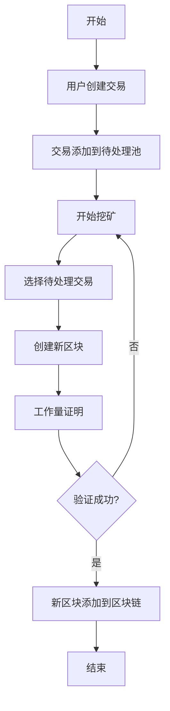

# SimpleBlockchain

# 问题
1. 在使用nodemon进行监听一个节点的时候，出现了问题，提示从文件中加载的区块链invalid
   需要或者每次添加区块之前（挖矿， 添加交易）， 节点从本地读取数据， 然后使用前一个区块的哈希


  **其他节点**
3. 当一个新的节点加入进来时， 需要从种子节点上下载区块链数据保存到本地
4. 然后才可以添加新的交易，并广播交易，其他节点受到广播后，将数据添加到本地


# 简单区块链系统

## 1. 概述

本文档旨在描述一个简单区块链系统的设计与实现。该系统允许用户创建和验证交易，并以区块的形式将它们链接到一个区块链上。每个区块包含多个交易，并且通过加密算法保证其安全性。本系统适用于学习和演示目的，展示区块链技术的基本工作原理。

## 2. 功能需求

- 创建交易：用户可以创建从一地址到另一地址的交易。
- 添加交易到区块：新创建的交易将被添加到待处理交易池中，并在下一轮挖矿中被打包进新区块。
- 挖矿：通过工作量证明（Proof of Work）机制，将待处理的交易打包成一个新的区块，并添加到区块链上。
- 区块链验证：确保区块链的完整性和一致性，防止篡改。

## 3. 系统设计

### 3.1 组件设计

- **区块（Block）**：包含时间戳、交易列表、前一个区块的哈希值、当前区块的哈希值和一个随机数（nonce）。
- **交易（Transaction）**：包含发送者地址、接收者地址和交易金额。
- **区块链（Blockchain）**：由多个区块按顺序链接组成的链。

### 3.2 数据流设计

1. 用户创建交易。
2. 交易被添加到待处理交易池。
3. 挖矿过程开始，选择待处理池中的交易，创建新的区块。
4. 新区块通过工作量证明机制被添加到区块链上。

### 3.3 流程图

以下是使用Visio或draw.io等工具创建的流程图，展示了交易从创建到被打包进区块并添加到区块链的整个过程。



### 3.4 设计考虑

- **数据结构**：使用链表来表示区块链，每个节点是一个区块。
- **安全性**：通过SHA-256算法为每个区块生成唯一的哈希值，确保区块链的不可篡改性。
- **性能**：简化的工作量证明算法，适用于教学和小规模演示，不适用于大规模生产环境。

## 4. 实现

### 4.1 技术栈

- **编程语言**：JavaScript
- **加密库**：crypto-js

### 4.2 关键代码实现

```javascript
class Block {
    constructor(timestamp, transactions, previousHash = '') {
        this.timestamp = timestamp;
        this.transactions = transactions;
        this.previousHash = previousHash;
        this.nonce = 0;
        this.hash = this.calculateHash();
    }

    calculateHash() {
        return sha256(this.previousHash + this.timestamp + JSON.stringify(this.transactions) + this.nonce).toString();
    }

    mineBlock(difficulty) {
        while (this.hash.substring(0, difficulty) !== Array(difficulty + 1).join("0")) {
            this.nonce++;
            this.hash = this.calculateHash();
        }
    }
}

class Blockchain {
    constructor() {
        this.chain = [this.createGenesisBlock()];
    }

    createGenesisBlock() {
        return new Block(Date.now(), [], "0");
    }

    getLatestBlock() {
        return this.chain[this.chain.length - 1];
    }

    addBlock(newBlock) {
        const latestBlock = this.getLatestBlock();
        newBlock.previousHash = latestBlock.hash;
        newBlock.mineBlock(2); // 难度设为2
        this.chain.push(newBlock);
    }
}
```

## 5. 测试

- **单元测试**：对每个类和方法进行单元测试，确保其按预期工作。
- **集成测试**：测试整个区块链系统的工作流程，从创建交易到添加区块和验证区块链的完整性。

## 6. 部署

- 本系统为演示和教学目的设计，可以在本地环境或小型服务器上部署。

## 7. 维护

- 定期更新加密库以保证安全性。
- 根据用户反馈进行功能改进和性能优化。

---

**备注**：本文档为简化示例，实际产品文档应包含更详细的技术规格、用户指南和维护手册。
